```mermaid
timeline
    title Linha do Tempo da Evolução dos Sistemas Operacionais

    section Década de 1950 (Lote / Batch)
        1956 : GM-NAA I/O (Primeiro SO em lote)
        1959 : FMS & IBSYS (Mainframes IBM)

    section Década de 1960 (Multiprogramação & Time-Sharing)
        1961 : CTSS (Primeiros testes interativos)
        1964 : OS/360 (IBM - Multiprogramação e Spooling)
        1965 : MULTICS (Projeto M.I.T. / Bell Labs / GE)
        1969 : UNIX (Ken Thompson e Dennis Ritchie)

    section Década de 1970 (Minicomputadores & Microprocessadores)
        1974 : CP/M (Primeiro padrão para micros de 8 bits)
        1977 : BSD (Derivado do UNIX com TCP/IP)
        1978 : Apple DOS (Apple II)

    section Década de 1980 (Revolução dos PCs & GUIs)
        1981 : MS-DOS / PC-DOS (Padrão IBM PC)
        1984 : Classic Mac OS (Popularização da Interface Gráfica)
        1985 : Windows 1.0 (GUI sobre MS-DOS)
             : AmigaOS (Multitarefa preemptivo e multimídia)
        1987 : MINIX (Criado por Tanenbaum - Micronúcleo)
             : OS/2 (IBM/Microsoft)

    section Década de 1990 (32 Bits, Open-Source & Internet)
        1991 : Linux (Criado por Linus Torvalds)
        1993 : Windows NT (Arquitetura 32 bits moderna)
             : Família BSD Aberta (FreeBSD, NetBSD, OpenBSD)
        1995 : Windows 95 (Menu Iniciar e Plug & Play)
        1998 : Windows 98 (Suporte nativo a USB e Web)

    section Anos 2000 (Consolidação & Eras Mobile)
        2000 : Windows 2000 (Base NT para corporativo)
        2001 : Mac OS X (Base Darwin/BSD + Interface Aqua)
             : Windows XP (Unificação das linhas NT e 9x)
        2007 : iOS (Lançamento do iPhone)
        2008 : Android (SO móvel open-source do Google)

    section Anos 2010 ao Presente (Nuvem & Dispositivos Híbridos)
        2009 : Windows 7
        2011 : ChromeOS (Foco em Cloud e Web)
        2012 : Windows 8 / 8.1 (Interface Metro para touch)
        2015 : Windows 10 (Windows como Serviço)
        2021 : Windows 11
        Presente : Ecossistema Atual (Linux na Nuvem, Android/iOS no Mobile, Windows/macOS no Desktop)
```

## 🎯 Conteúdos Abordados

- Conceito e prática de **Commit**
- Mapeamento e ideação com a ferramenta **Miro**
- **Criação de Repositórios** no GitHub
- Criação e **formatação de arquivos `.md`** (Markdown)

---

## 📌 1. O que é Commit?

O **commit** funciona como um "ponto de salvamento" (*checkpoint*) no histórico do seu projeto. Sempre que você faz uma alteração relevante no código ou na documentação e confirma o commit, você registra o estado exato do repositório naquele momento.

* **Boas práticas de commit:**
  * Escrever mensagens claras e objetivas.
  * Descrever o que foi alterado ou adicionado.
  * Mantenha um histórico organizado.

---

## 🎨 2. Planejamento com o Miro

O **Miro** é uma ferramenta de lousa virtual usada para planejar e estruturar ideias visualmente antes ou durante o desenvolvimento.

### Para que utilizamos:
- Criar **fluxogramas** e mapas mentais.
- Organizar tarefas e ideias com post-its virtuais.
- Fazer *brainstorming* em equipe.
- Esboçar estruturas e telas do projeto.

---

## 📁 3. Criação de Repositórios no GitHub

Aprendemos o passo a passo para inicializar um novo projeto diretamente na plataforma do GitHub:

1. Acessar o perfil no GitHub e ir na aba **Repositories**.
2. Clicar no botão **New**.
3. Definir o nome do repositório e uma breve descrição.
4. Escolher a visibilidade (Público ou Privado).
5. Inicializar o repositório (incluindo ou não o arquivo `README.md`).

---

## 📝 4. Criação e Formatação de Arquivos `.md`

Aprendemos a criar e estruturar arquivos Markdown (`.md`) para documentar os projetos de forma visual e organizada.

### Principais formatações que aprendemos:

| Elemento | Sintaxe Markdown | Resultado |
| :--- | :--- | :--- |
| **Título** | `# Título` | Título Principal |
| **Subtítulo** | `## Subtítulo` | Subtítulo |
| **Negrito** | `**texto**` | **texto** |
| **Itálico** | `*texto*` | *texto* |
| **Lista** | `- item` | • item |
| **Código** | `` `código` `` | `código` |

---

# 🖥️ Evolução dos Sistemas Operacionais

| Ano | Sistema Operacional | Imagem / Logo | Principais Características |
| :---: | :--- | :---: | :--- |
| **1965** | **Multics** |  | • Desenvolvido por MIT, AT&T e GE • Sistema multiusuário e multitarefa pioneiro |
| **1969** | **Unix** |  | • Criado por Ken Thompson e Dennis Ritchie • Base para a maioria dos SOs modernos |
| **1972** | **Unix (em C)** |  | • Reescrito em linguagem C • Ganhou portabilidade para múltiplos hardwares |
| **1981** | **MS-DOS** |  | • Lançado junto com o IBM PC • Sistema operacional em linha de comando |
| **1984** | **Mac OS (System 1)** |  | • Popularizou a Interface Gráfica (GUI) • Introduziu o uso massivo do mouse |
| **1985** | **Windows 1.0** |  | • Primeira interface gráfica da Microsoft • Funcionava como uma camada sobre o MS-DOS |
| **1991** | **Linux Kernel** |  | • Criado por Linus Torvalds • Kernel de código aberto (Open Source) |
| **1993** | **Windows NT** |  | • Arquitetura 32-bits voltada a corporações • Base dos Windows modernos (XP, 10, 11) |
| **2001** | **Mac OS X*# 🖥️ Guia Didático: A Evolução dos Sistemas Operacionais

### 💡 O que é um Sistema Operacional?

Um **Sistema Operacional (S.O.)** é o programa fundamental que atua como **intermediário entre o hardware do computador e os aplicativos que usamos** (como navegadores, jogos e editores de texto).

Sua principal função é **gerenciar os recursos** da máquina (processador, memória RAM, armazenamento e dispositivos de entrada/saída) e **fornecer abstrações amigáveis** para que os programadores e usuários não precisem lidar diretamente com os circuitos elétricos e comandos de baixíssimo nível da CPU.

---

### ⏳ Por que estudar a linha do tempo dos S.O.s?

Os sistemas operacionais que usamos hoje nos nossos celulares e computadores não surgiram do dia para a noite. Eles são o resultado de **mais de 70 anos de evolução tecnológica**, impulsionados por avanços no hardware e por novas necessidades dos usuários:

1. **Geração das Válvulas e Cartões Perfurados (Anos 1940-1950):** Não existiam S.O.s; os programas eram executados um a um manualmente.
2. **Sistemas em Lote / Batch (Anos 1950-1960):** Automação básica de filas de execução para evitar desperdício de tempo do processador.
3. **Multiprogramação e Compartilhamento de Tempo (Anos 1960-1970):** A CPU passou a alternar entre vários programas rapidamente, permitindo múltiplos usuários simultâneos (surgimento do **UNIX**).
4. **Revolução do Computador Pessoal e Interfaces Gráficas (Anos 1980-1990):** Computadores nas casas das pessoas, migração do modo texto (**MS-DOS**) para telas com janelas, ícones e mouse (**Mac OS**, **Windows** e **Linux**).
5. **Era Móvel e Computação em Nuvem (Anos 2000-Presente):** Migração para dispositivos portáteis (**Android**, **iOS**) e sistemas otimizados para servidores massivos e nuvem.

---

Abaixo, você encontrará uma **linha do tempo detalhada e visual** que marca o nascimento e a consolidação dos principais sistemas operacionais criados ao longo da história da computação.* |  | • Reconstrução baseada em Unix (BSD/Darwin) • Unificou estabilidade e interface Aqua |
| **2008** | **Android** |  | • Sistema operacional móvel baseado em Linux • Sistema mais utilizado em smartphones |

---

